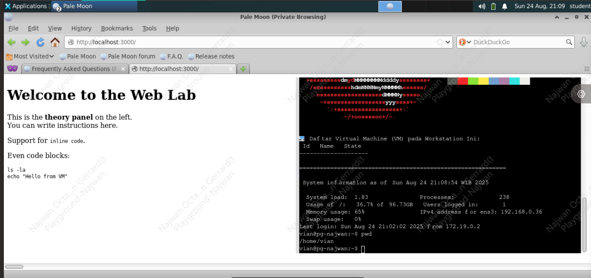
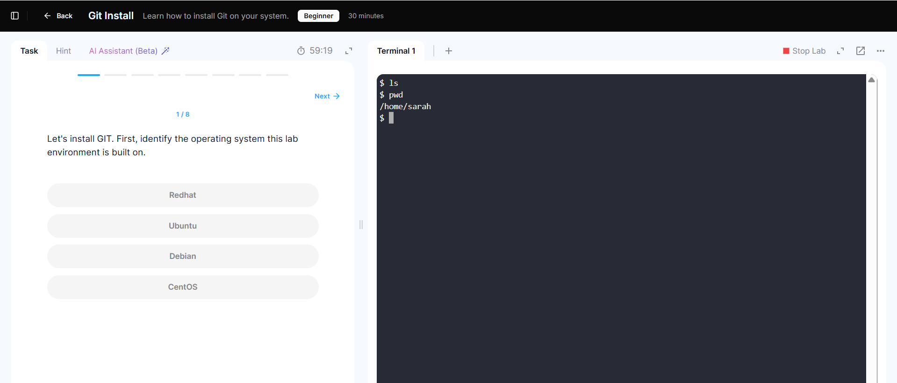

# Split-Window-MD-and-Terminal

This program aims to provide a learning LMS that makes it easy for participants to learn, especially IT-related topics, and allows them to directly participate in hands-on labs, because this program has been integrated into a VM where we can directly configure and try out the lab in just one window. The program is built with two windows: the left side displays the step-by-step instructions for the lab, while the right side features a terminal directly connected to the provided VM.

Here are the results:



---

# General Information
### Port Mapping
- Backend run on port `3001`
- Fronend run on port `3000`

---

### Connection SSH backend into VM
You can adjust the credentials to connecnt SSH to VM for terminal window.
- Open file `backend/server.js`
```bash 
nano backend/server.js
```
- scroll down and you can adjust on section code like in the below

```js
    .connect({
      host: "host.docker.internal",  //in this case using docker host VM
      port: 22, // port of SSH, if using custom you can adjust
      username: "<USERNAME>",
      password: "<PASSWORD>"
    });
```

> On Progress Development, not a finish code

---

### Change the content LMS
You can change the Content instruction on left panel, you just go on folder `public`, and now you can create a Markdown file to change the content teory or instruction
- Change directory
```bash
cd Split-Window-MD-and-Terminal/frontend/public
```

- edit file `sample.md` or you can create new file with extention `.md` (markdown file)
```bash
nano sample.md
```

- If you create new file, you want to adjust on file `MarkdownPanel.js` pathing the markdown file new.
```bash
nano Split-Window-MD-and-Terminal/frontend/components/MarkdownPanel.js
```

- Go to section code like in the below
```js
  useEffect(() => {
    fetch("/sample.md")  // path markdown file from folder public/
      .then((res) => res.text())
      .then((text) => setContent(text));
  }, []);
```
> On Progress Development, not a finish code

---

# Installation

## 1. Manual
### Prerequisites
- Minimal NodeJS version 18

### A. Backend

- Change directory to `backend`
  ```bash
  cd Split-Window-MD-and-Terminal/backend
  ```
- install dependencies npm
  ```bash
  npm install
  ```
- run the program
  ```bash
  npm start
  ```

---

### B. Frontend

- Change directory to `frontend`
  ```bash
  cd Split-Window-MD-and-Terminal/frontend
  ```
- install dependencies npm
  ```bash
  npm install
  ```
- run build
  ```bash
  npm run build
  ```
- running the program
  ```bash
  npm start
  ```
---

## 2. Container Docker
### Prerequisites
- Docker
- Docker compose

### Running
- Change directory to `Split-Window-MD-and-Terminal`
  ```bash
  cd Split-Window-MD-and-Terminal/
  ```
- run and build the container
  ```bash
  docker compose up -d --build
  ```

### Delete the container
- Change directory to `Split-Window-MD-and-Terminal`
  ```bash
  cd Split-Window-MD-and-Terminal/
  ```
- Delete container
  ```bash
  docker compose down --rmi all
  ```
---

# How to Use it?
You can check the output on browser using
```
http://localhost:3000
```
And now there show output like this for example, on right panel, you can run command linux like in the real VM or computer with os Ubuntu linux for this example, and you can configure it. It same like Real the computer or VM


---
# Reference Idea

- Hands on Lab in [DqLab](https://dqlab.id/) Course

- Hands on free Labs in [kodeCloud](https://kodekloud.com/)

